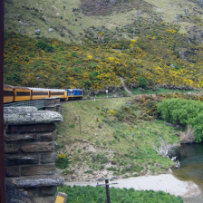
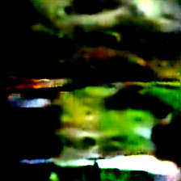
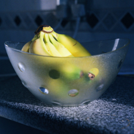
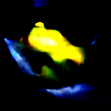
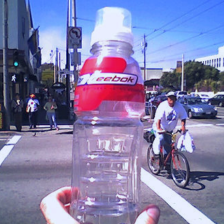
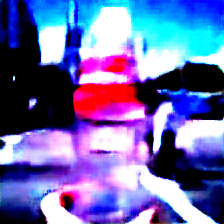
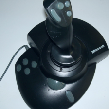
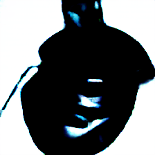

# Input Image Reconstruction from Deep Network Features

## Abstract
Reconstructing input images from intermediate neural network features provides insight into the information preserved at different depths of deep models.  
This project leverages a pretrained **ResNet‑50** and a convolutional decoder to reconstruct 224×224 images from multi‑layer feature maps.  
Reconstruction quality is evaluated using **MSE, PSNR, and SSIM**, with the pipeline designed to run efficiently under Google Colab GPU constraints.  
The emphasis is on **reproducibility, interpretability, and educational clarity**.


## Problem Statement
Deep convolutional networks achieve state‑of‑the‑art performance on vision tasks, yet their **internal feature representations remain difficult to interpret**.  
This project explores:
- How much spatial detail and semantic structure is preserved at different depths of ResNet‑50.  
- Whether a lightweight decoder can reconstruct meaningful images from multi‑layer features under memory constraints.  
- How quantitative metrics (**MSE, PSNR, SSIM**) align with qualitative visual fidelity.  
- How to design a reproducible pipeline that runs efficiently in Google Colab.  


## Project Overview
This project demonstrates how input images can be reconstructed from feature maps extracted at multiple depths of **ResNet‑50**.  
The goal is to study how well a decoder can invert intermediate representations and to understand what spatial and semantic information is retained or lost across layers.

### Objectives
- Train decoder networks to reconstruct images directly from feature maps.  
- Compare reconstructions across four representative ResNet‑50 layers (early, mid, deep, very deep).  
- Evaluate results using both **quantitative metrics** and **qualitative comparisons**.  
- Ensure reproducibility through version control, logging, and documented workflows.  

### Motivation
- Interpret deep networks by visualizing what internal features encode.  
- Explore invariance and abstraction by comparing reconstructions from different depths.  
- Provide a compact, reproducible pipeline suitable for teaching, experimentation, and future research.  


## Dataset
- **ImageNet ILSVRC2012 validation split** (50,000 labeled images across 1,000 classes).  
- Images obtained from the [official ImageNet website](https://www.image-net.org/).  
- Ground‑truth labels available via [ILSVRC2012_validation_ground_truth.txt](https://github.com/Spiritator/machine-learning-dataset-tool/blob/master/ILSVRC2012_validation_ground_truth.txt).  

**Notes:**
- Only the validation split is used due to compute/storage constraints.  
- Data organized into per‑class folders for `torchvision.datasets.ImageFolder`.  
- Full ImageNet‑1K dataset was not feasible under Colab GPU limits.  


## Methodology

### 1. Data Loading
- Loads validation images with `ImageFolder` and `DataLoader`.  
- Applies standard ImageNet preprocessing: resize → center crop → tensor conversion → normalization.  

### 2. Feature Extraction
- Loads pretrained **ResNet‑50** from `torchvision.models`.  
- Registers forward hooks on four layers:  
  - `layer1.2.relu`  
  - `layer2.3.relu`  
  - `layer3.5.relu`  
  - `layer4.2.relu`  
- `FeatureExtractor` outputs feature maps in a fixed order per batch.  

### 3. Feature Concatenation
- Resizes feature maps to a common spatial size via bilinear interpolation.  
- Concatenates along the channel dimension to form a unified tensor for the decoder.  

### 4. Decoder Architecture
- Implements **ConvOnlyDecoder**, a fully convolutional decoder with stacked `ConvTranspose2d` layers.  
- Progressively upsamples features back to 224×224 resolution.  
- Uses ReLU activations and a final Sigmoid for outputs in [0,1].  

### 5. Training
- Optimizes with **MSE loss** between reconstructed and original images.  
- Configurable batch size and learning rate.  
- Logs average training loss per epoch.  

### 6. Evaluation
- Reconstructs batches and displays **original vs reconstructed pairs**.  
- Computes **MSE, PSNR, SSIM**.  
- Combines metrics with qualitative plots for comprehensive evaluation.  

### 7. Saving Outputs
- Saves trained decoder weights.  
- Exports original/reconstruction pairs and training loss curves into `results/`.  


## Environment and Data Handling

###  Google Colab + Google Drive
```bash
from google.colab import drive
drive.mount('/content/drive')
```

- Connects **Colab** to **Google Drive** for persistent storage of **datasets, checkpoints, and results**.


### Large Dataset Upload Strategy

##### Split 6GB archive into 2GB chunks
```bash

split -b 2000M ILSVRC2012_img_val.tar part_
```

#### Reassemble in Colab
```bash

!cat /content/drive/MyDrive/part_* > /content/ILSVRC2012_img_val.tar
```
- Extracted and organized into **per‑class folders** for use with `torchvision.datasets.ImageFolder`.

## Training and Results

- Trained for **32 epochs**.  
- Loss decreased from **0.97 → 0.88**.  

### Final Metrics
- **MSE ≈ 1.00**  
- **PSNR ≈ 1.25 dB**  
- **SSIM ≈ 0.15**  

### Observations
- Reconstructions are blurred but retain coarse spatial and color information.  
- Side‑by‑side comparisons are saved in the `results/` directory.

## Results Folder

### Filename Pattern
- `original_X.jpg` → Ground truth image  
- `reconstruction_X.jpg` → Decoder output  

### Visual Examples
| Original Image | Reconstruction |
|----------------|----------------|
|  |  |
|  |  |
|  |  |
|  |  |

- Each row shows the **original input image** (left) and the **decoder’s reconstructed output** (right).


## Repository Structure
```bash
├── README.md
├── requirements.txt
├── import.py                   # Environment setup
├── data_loader.py              # Loads and preprocesses ImageNet validation images
├── feature_extract.py           # Extracts features from ResNet-50
├── extract_and_concat_feature.py # Resize + concatenate feature maps
├── decoder.py                   # Decoder architecture
├── initialize_decoder.py        # Decoder initialization
├── train.py                     # Training loop (MSE loss, logging)
├── reconstruct_and_evaluate.py  # Reconstruction, visualization, metrics
├── save_decoder.py              # Save trained decoder
├── save_reconstruction.py       # Save reconstructed outputs
├── results/                     # Example reconstructions and plots
├── logs/                        # Weekly progress logs
│   ├── week1log.txt
│   ├── week2log.txt
│   ├── week3log.txt
│   ├── week4log.txt
│   └── week5log.txt
└── notebooks/                   # Colab notebooks for analysis
```


## Setup and Usage


### Install dependencies
```bash
pip install -r requirements.txt
```

### Train the decoder
```bash
python train.py
```
### Reconstruct and evaluate
```bash
python reconstruct_and_evaluate.py
```


## References

- Deng, J.; Dong, W.; Socher, R.; Li, L.; Li, K.; Fei‑Fei, L.  
  *ImageNet: A Large‑Scale Hierarchical Image Database.*  
  Proceedings of the IEEE Conference on Computer Vision and Pattern Recognition (CVPR), 2009.

- He, K.; Zhang, X.; Ren, S.; Sun, J.  
  *Deep Residual Learning for Image Recognition.*  
  Proceedings of the IEEE Conference on Computer Vision and Pattern Recognition (CVPR), 2016.

- Wang, Z.; Bovik, A.; Sheikh, H.; Simoncelli, E.  
  *Image Quality Assessment: From Error Visibility to Structural Similarity.*  
  IEEE Transactions on Image Processing, 2004.

- Johnson, J.; Alahi, A.; Fei‑Fei, L.  
  *Perceptual Losses for Real‑Time Style Transfer and Super‑Resolution.*  
  European Conference on Computer Vision (ECCV), 2016.


## License


MIT License – See LICENSE file for details.


## Author
**Lawrence A. Egharevba** – *CAP6415 – Computer Vision (Fall 2025)* – **Florida Atlantic University (FAU)**

## Contact

📧 **Email** legharevba2024@fau.edu | asemotalea@gmail.com  

**Maintained by the CAP6415 Project Team** – *Computer Vision – Fall 2025* – **Florida Atlantic University (FAU)**


